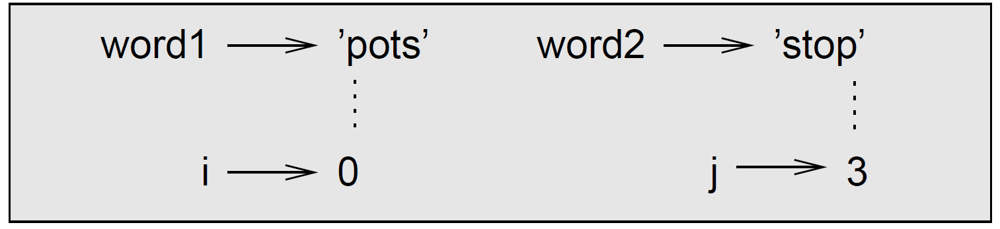

# Debugging

When you use indices to traverse the values in a sequence, it is tricky to get the beginning and end of the traversal right. Here is a function that is supposed to compare two words and return `True` if one of the words is the reverse of the other, but it contains two errors:

\beforeverb \begin{pycode}&#x20;


```python
def is_reverse(word1, word2): 
    if len(word1) != len(word2): 
        return False
    i = 0
    j = len(word2)
    while j > 0:
        if word1[i] != word2[j]:
            return False
        i = i+1
        j = j-1
    return True
```


The first `if` statement checks whether the words are the same length. If not, we can return `False` immediately and then, for the rest of the function, we can assume that the words are the same length. This is an example of the guardian pattern in <mark style="background-color:red;">\prettyref{sec:guardian}</mark>.&#x20;

&#x20;`i` and `j` are indices: `i` traverses `word1` forward while `j` traverses `word2` backward. If we find two letters that don't match, we can return `False` immediately. If we get through the whole loop and all the letters match, we return `True`.

If we test this function with the words `'pots'` and `'stop'`, we expect the return value `True`, but we get an `IndexError`:

```bash
>>> is_reverse('pots', 'stop') 
   File "reverse.py", line 15, 
       in is_reverse if word1[i] != word2[j]: 
   IndexError: string index out of range
```

For debugging this kind of error, my first move is to print the values of the indices immediately before the line where the error appears.


```python
while j > 0: 
    print(i, j) # print here
    if word1[i] != word2[j]:
         return False
    i = i+1
    j = j-1
```


Now when I run the program again, I get more information:

```bash
>>> is_reverse('pots', 'stop')
 0 4 
 IndexError: string index out of range
```

The first time through the loop, the value of `j` is 4, which is out of range for the string `'pots'`. The index of the last character is 3, so the initial value for `j` should be `len(word2)-1`.

If I fix that error and run the program again, I get:

```bash
>>> is_reverse('pots', 'stop')
 0 3 
 1 2 
 2 1 
 True
>>>
```

This time we get the right answer, but it looks like the loop only ran three times, which is suspicious. To get a better idea of what is happening, it is useful to draw a state diagram. During the first iteration, the frame for `is_reverse` looks like this:

<figure><figcaption><p>Frame of the first iteration of the function <code>is_reverse</code>.</p></figcaption></figure>

I took a little license by arranging the variables in the frame and adding dotted lines to show that the values of `i` and `j` indicate characters in `word1` and `word2`.

**Exercise:** Starting with this diagram, execute the program on paper, changing the values of `i` and `j` during each iteration. Find and fix the second error in this function.

## List

Careless use of lists (and other mutable objects) can lead to long hours of debugging. Here are some common pitfalls and ways to avoid them:

### Do not write code for list in the same way as for strings

Don't forget that most list methods modify the argument and return `None`. This is the opposite of the string methods, which return a new string and leave the original alone. If you are used to writing string code like this:

```python
word = word.strip()
```

It is tempting to write list code like this:

```python
 t = t.sort() # WRONG!
```

Because `sort` returns `None`, the next operation you perform with `t` is likely to fail.

Before using list methods and operators, you should read the documentation carefully and then test them in interactive mode.&#x20;

### Pick an idiom and stick with it.

Part of the problem with lists is that there are too many ways to do things. For example, to remove an element from a list, you can use `pop`, `remove`, `del`, or even a slice assignment. To add an element, you can use the `append` method or the `+` operator. Assuming that `t` is a list and `x` is a list element, these are right:


```python
t = [1,2,3]
x= 4
# RIGHT approach to add a number to the list
t.append(x) 
t = t + [x] 
```


And these are wrong:


```python
t.append([x]) # WRONG! t would be [1,2,3,[4]]
t = t.append(x) # WRONG! t is None
t + [x] # WRONG! t is not updated
t = t + x # WRONG! 
          # TypeError: can only concatenate list (not "int") to list
```


### Make copies to avoid aliasing.

If you want to use a method like `sort` that modifies the argument, but you need to keep the original list as well, you can make a copy.

```bash
>>> copied = t.copy()
>>> copied.sort()
>>>
```

Alternatively, you can do a copy using slicing:

```bash
>>> copied = t[:]
>>> copied.sort()
>>>
```

In this example you could also use the built-in function `sorted`, which returns a new, sorted list and leaves the original alone. But in that case you should avoid using `sorted` as a variable name!
