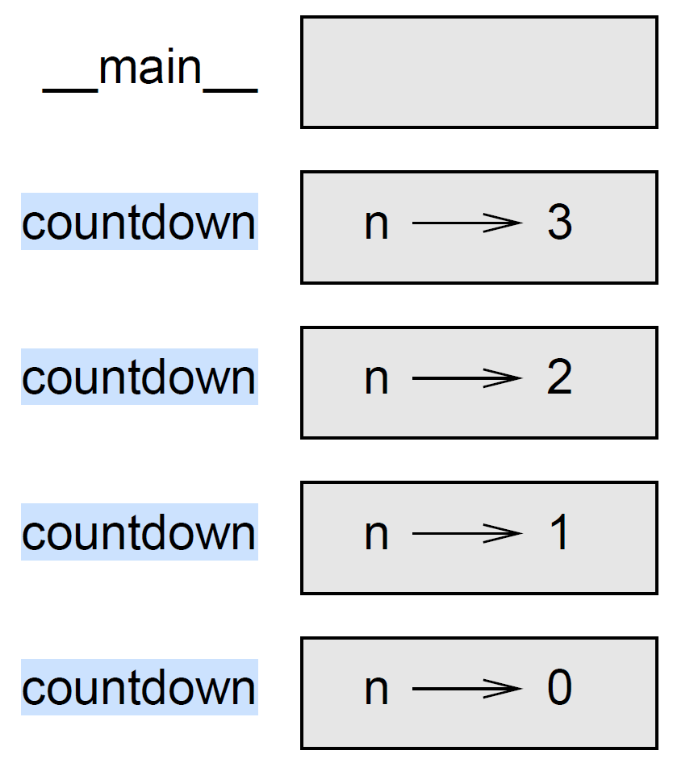

# Recursion



The concept of recursion is a challenging concept which sometimes inspires fears among students. For some it is a natural way of thinking and they will find the concept almost trivial, whereas for others it will take more time. Don't be discouraged, after some effort you will find the concept rather elegant and intuitive.

## A definition

_**"In mathematical logic and computer science recursive definition or inductive definition is used to define an object in terms of itself. "**_

This definition of Eczel may seem obscure at first but it will become clearer later when we talk about function and recursive data structure. Eczel’s definition can be read as follows when we consider only the case of function definition. A recursive definition of a function defines the value of a function for some inputs in terms of the value of the same function for other (usually smaller) inputs. Let's look at a well know mathematical function, $$n!$$ (factorial $$n$$). Factorial n can be define as follow:

$$
n! = n \times (n-1)!
$$

As you can see, factorial $$n$$ is defined in term of factorial but for a smaller value $$n-1$$. There is however a small issue with this definition as it is, that is we cannot compute the value of $$n!$$.&#x20;

$$
\begin{eqnarray} n! & = & n \times (n-1)! \\   & =& n \times (n-1)\times (n-2)! \\ & = &n \times (n-1)\times (n-2)\times ...\times 0! \\  & = & ...\end{eqnarray}
$$

This definition can be expanded forever and never stops. Clearly something is missing. A function exhibits recursive behaviour when it can be defined by two properties:&#x20;

* a simple base case (or cases)&#x20;
* and a set of rules which reduce all other cases towards the base case.

So we are missing a base case in our definition of factorial, and this base case is $$0!=1$$. Now that we have defined the general case and a base case we can compute the values of the factorial function as shown below for $$3!$$.

$$
\begin{eqnarray} 3! & = & 3 \times 2! \\ & =& 3 \times 2\times 1! \\ & = &3 \times 2\times 1\times 0! \\  & = &3 \times 2\times 1\times 1 \\  & = &3 \times 2\times 1\\  & = &3 \times 2\\ & = &6  \end{eqnarray}
$$

Now that we have seen a definition of recursion, let's see how it can be implemented in Python.

## First Examples

Rather than using `while` or `for` loops, we can implement repetition through recursion. It is legal for one function to call another; it is also legal for a function to call itself, and in that case the function is said to be **recursive**, and the process is called **recursion**. It may not be obvious why that is a good thing, but it turns out to be one of the most magical things a program can do.&#x20;

For example, look at the following function:


```python
def countdown(n): 
    if n <= 0: 
        print('Blastoff!') 
    else: 
        print(n) 
    countdown(n-1) 
```


If `n` is `0` or negative, it outputs the word, `Blastoff!` Otherwise, it outputs `n` and then calls a function named `countdown` -itself- passing `n-1` as an argument.

What happens if we call this function like this?

```
>>> countdown(3) 
```

* The execution of `countdown` begins with `n=3`, and since `n` is greater than `0`, it outputs the value `3`, and then calls itself...
  * The execution of `countdown` begins with `n=2`, and since `n` is greater than `0`, it outputs the value `2`, and then calls itself...
    * The execution of `countdown` begins with `n=1`, and since `n` is greater than `0`, it outputs the value `1`, and then calls itself...
      * The execution of `countdown` begins with `n=0`, and since `n` is not greater than `0`, it outputs the word, `Blastoff!` and then returns.&#x20;
    * The `countdown` that got `n=1` returns.
  * The `countdown` that got `n=2` returns.&#x20;
* The `countdown` that got `n=3` returns.

And then you're back in `main`. So, the output looks like this:

```
3 
2 
1 
Blastoff! 
```

A recursive function calls itself, usually on a smaller argument. The sequence of calls must eventually terminate in a **base case** that does not generate a new **recursive call**. For the function `countdown`, line 2-3 constitute the base case, whereas line 6 is the recursive call.


A recursive function may have multiple base cases (**at least one**), and multiple recursive calls.


**Exercise:** Implement a recursive function `factorial(n)` that takes a positive integer as parameter and return $$n!$$. Use the mathematical definition provided below.

* $$0! = 1$$,
* $$\forall n>0, n! = n\times (n-1)!$$

<details>

<summary>Answer</summary>


</details>

As another example, we can write a function that prints a string `n` times.


```python
def print_n(s, n): 
    if n <= 0: 
        return 
    print(s) 
    print_n(s, n-1)
```


If `n <= 0` the `return` statement exits the function. The flow of execution immediately returns to the caller, and the remaining lines of the function are not executed.

The rest of the function is similar to `countdown`:

* if `n` is greater than `0`, it displays `s` and then calls itself to display `s` $$n-1$$ additional times. So the number of lines of output is $$1 + (n - 1)$$, which adds up to `n`.

For simple examples like this, it is probably easier to use a `for` loop. But we will see examples later that are hard to write with a `for` loop and easy to write with recursion, so it is good to start early.

## Stack diagrams for recursive functions

We used a stack diagram to represent the state of a program during a function call. The same kind of diagram can help interpret a recursive function. Every time a function gets called, Python creates a new function frame, which contains the function's local variables and parameters. For a recursive function, there might be more than one frame on the stack at the same time.

This figure below shows a stack diagram for `countdown` called with `n = 3`:

<figure><figcaption><p>stack diagram for <code>countdown</code> called with <code>n = 3</code>.</p></figcaption></figure>

As usual, the top of the stack is the frame for `main`. It is empty because we did not create any variables in `main` or pass any arguments to it.

The four `countdown` frames have different values for the parameter `n`. The bottom of the stack, where `n=0`, is called the **base case**. It does not make a recursive call, so there are no more frames.

**Exercise:** Draw a stack diagram for `print_n` called with `s = 'Hello'` and `n=2`

<details>

<summary>Answer</summary>


</details>

**Exercise:** Draw a stack diagram for `factorial` called with`n=3`.

<details>

<summary>Answer</summary>


</details>

## Infinite recursion

If a recursion never reaches a base case, it goes on making recursive calls forever, and the program never terminates. This is known as `infinite recursion`, and it is generally not a good idea. Here is a minimal program with an infinite recursion:


```python
def recurse(): 
    recurse() 
```


In most programming environments, a program with infinite recursion does not really run forever. Python reports an error message when the maximum recursion depth is reached:

```bash
>>> recurse() 
 Traceback (most recent call last): 
     File "<pyshell#0>", line 1, in recurse() 
     File "chapter_recursion.py", line 19, in recurse 
     recurse() File "chapter_recursion.py", line 19, in recurse 
     recurse() File "chapter_recursion.py", line 19, in recurse 
     recurse() [Previous line repeated 990 more times] 
 RecursionError: maximum recursion depth exceeded
```

This traceback is a little bigger than the one we saw in the previous chapter. When the error occurs, there are 1000 `recurse` frames on the stack!

## Requirements&#x20;

As we have seen in the definition of recursion, there are two general requirements for recursive functions:&#x20;

* The base case(s) need to be checked first, before the recursive call.&#x20;
* The argument(s) of the recursive call(s) must be smaller (in other word get closer to a base case); otherwise we will end up with an infinite recursion as the base case(s) will never be reached.&#x20;

These two requirements together ensure that the recursion stops and a value is returned. Otherwise, we will encounter an [infinite recursion](recursion.md#infinite-recursion) error seen in earlier.


In fact, there is a limit to what the interpreter can compute recursively, because it needs to keep track of all of the ongoing, partial computations in the call stack. Despite our function `countdown` being correctly implemented, calling `countdown(1000}` will result in the same error as an infinite recursion. Other programming languages like 'Scheme', 'Common Lisp', and 'Haskell' are better suited than Python for recursive programming.


## Iterative versus Recursive functions


