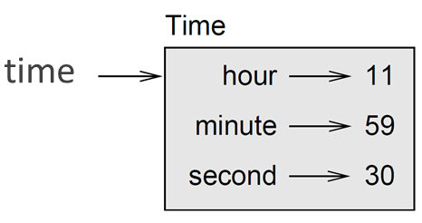

# Classes and Functions



## Time

As another example of a user-defined type, we'll define a class called `Time` that records the time of day. The class definition looks like this:


```python
class Time: 
    """represents the time of day. attributes: hour, minute, second"""

```


We can create a new `Time` object and assign attributes for hours, minutes, and seconds:

```bash
>>> time = Time() 
>>> time.hour = 11 
>>> time.minute = 59 
>>> time.second = 30 
>>>
```

The state diagram for the `Time` object looks like this:

<figure><figcaption><p>State diagram of the <code>Time</code> object assigned to the variable <code>time</code>.</p></figcaption></figure>

**Exercise:** Write a function called `print_time` that takes a Time object and prints it in the form `hour:minute:second`.


**Hint:** the format sequence `'%.2d'` prints an integer using at least two digits, including a leading zero if necessary.&#x20;


<details>

<summary>Answer</summary>


</details>

**Exercise:**

Write a boolean function called `is_after` that takes two Time objects, `t1` and `t2`, and returns `True` if `t1` follows `t2` chronologically and `False` otherwise.

Challenge: don't use an `if` statement.

## Pure functions

In the next few sections, we'll write two functions that add time values. They demonstrate two kinds of functions: pure functions and modifiers. They also demonstrate a development plan I'll call **prototype and patch**, which is a way of tackling a complex problem by starting with a simple prototype and incrementally dealing with the complications.

Here is a simple prototype of `add_time`:


```python
def add_time(t1, t2): 
    sum = Time() 
    sum.hour = t1.hour + t2.hour 
    sum.minute = t1.minute + t2.minute 
    sum.second = t1.second + t2.second 
    return sum 
```


The function creates a new `Time` object, initialises its attributes, and returns a reference to the new object. This is called a **pure function** because it does not modify any of the objects passed to it as arguments and it has no effect, like displaying a value or getting user input, other than returning a value.

To test this function, I'll create two Time objects: `start` contains the start time of a movie, like "_Monty Python and the Holy Grail"_, and `duration` contains the run time of the movie, which is one hour 35 minutes. `add_time` figures out when the movie will be done.

```bash
>>> start = Time() 
>>> start.hour = 9 
>>> start.minute = 45 
>>> start.second = 0
>>> duration = Time() 
>>> duration.hour = 1 
>>> duration.minute = 35 
>>> duration.second = 0
>>> done = add_time(start, duration) 
>>> print_time(done) 
 10:80:00 
>>>
```

The result, `10:80:00` might not be what you were hoping for. The problem is that this function does not deal with cases where the number of seconds or minutes adds up to more than sixty. When that happens, we have to "carry" the extra seconds into the minute column or the extra minutes into the hour column.

Here's an improved version:


```python
def add_time(t1, t2): 
    sum = Time() 
    sum.hour = t1.hour + t2.hour 
    sum.minute = t1.minute + t2.minute 
    sum.second = t1.second + t2.second
    if sum.second >= 60:
        sum.second -= 60
        sum.minute += 1
    if sum.minute >= 60:
        sum.minute -= 60
        sum.hour += 1
    return sum
```


Although this function is correct, it is starting to get big. We will see a shorter alternative later.

## Modifiers

Sometimes it is useful for a function to modify the objects it gets as parameters. In that case, the changes are visible to the caller. Functions that work this way are called **modifiers**. `increment`, which adds a given number of seconds to a `Time` object, can be written naturally as a modifier. Here is a rough draft:


```python
def increment(time, seconds): 
    time.second += seconds
    if time.second >= 60:
        time.second -= 60
        time.minute += 1
    if time.minute >= 60:
        time.minute -= 60
        time.hour += 1
```


The first line performs the basic operation; the remainder deals with the special cases we saw before.

Is this function correct? What happens if the parameter `seconds` is much greater than sixty?\
In that case, it is not enough to carry once; we have to keep doing it until `time.second` is less than sixty. One solution is to replace the `if` statements with `while` statements. That would make the function correct, but not very efficient.

**Exercise:** Write a correct version of `increment` that doesn't contain any loops.&#x20;

<details>

<summary>Answer</summary>


</details>

Anything that can be done with modifiers can also be done with pure functions. In fact, some programming languages only allow pure functions. There is some evidence that programs that use pure functions are faster to develop and less error-prone than programs that use modifiers. But modifiers are convenient at times, and functional programs tend to be less efficient.

In general, I recommend that you write pure functions whenever it is reasonable and resort to modifiers only if there is a compelling advantage.

**Exercise:** Write a "pure" version of `increment` that creates and returns a new Time object rather than modifying the parameter.&#x20;

<details>

<summary>Answer</summary>


</details>

## Prototyping versus planning

The development plan I am demonstrating is called **prototype and patch**. For each function, I wrote a prototype that performed the basic calculation and then tested it, patching errors along the way. This approach can be effective, especially if you don't yet have a deep understanding of the problem. But incremental corrections can generate code that is unnecessarily complicated -since it deals with many special cases - and unreliable -since it is hard to know if you have found all the errors.

An alternative is **planned development**, in which high-level insight into the problem can make the programming much easier. In this case, the insight is that a Time object is really a three-digit number in base 60 ([Sexagesimal](https://www.wikipedia.org/wiki/Sexagesimal)). The `second` attribute is the "ones column", the `minute` attribute is the "sixties column", and the `hour` attribute is the "thirty-six hundreds column".

When we wrote `add_time` and `increment`, we were effectively doing addition in base 60, which is why we had to carry from one column to the next. This observation suggests another approach to the whole problem - we can convert `Time` objects to integers and take advantage of the fact that the computer knows how to do integer arithmetic.

Here is a function that converts Times to integers:


```python
def time_to_int(time): 
    minutes = time.hour * 60 + time.minute 
    seconds = minutes * 60 + time.second 
    return seconds 
```


And here is the function that converts integers to Times (recall that `divmod` divides the first argument by the second and returns the quotient and remainder as a tuple).


```python
def int_to_time(seconds): 
    time = Time() 
    minutes, time.second = divmod(seconds, 60) 
    time.hour, time.minute = divmod(minutes, 60) 
    return time 
```


You might have to think a bit, and run some tests, to convince yourself that these functions are correct.&#x20;

One way to test them is to check that `time_to_int(int_to_time(x)) == x` for many values of `x`. This is an example of a consistency check. Once you are convinced they are correct, you can use them to rewrite `add_time`:


```python
def add_time(t1, t2): 
    seconds = time_to_int(t1) + time_to_int(t2) 
    return int_to_time(seconds) 
```


This version is shorter than the original, and easier to verify.

**Exercise:** Rewrite `increment` using `time_to_int` and `int_to_time`.&#x20;

<details>

<summary>Answer</summary>


</details>

In some ways, converting from base 60 to base 10 and back is harder than just dealing with times. Base conversion is more abstract; our intuition for dealing with time values is better. But if we have the insight to treat times as base 60 numbers and make the investment of writing the conversion functions (`time_to_int` and `int_to_time`), we get a program that is shorter, easier to read and debug, and more reliable.&#x20;

It is also easier to add features later. For example, imagine subtracting two Times to find the duration between them. The naïve approach would be to implement subtraction with borrowing. Using the conversion functions would be easier and more likely to be correct.

Ironically, sometimes making a problem harder (or more general) makes it easier (because there are fewer special cases and fewer opportunities for error).

**Exercise:** Implement a function `time_difference(time1, time2)` which returns the time difference between `time1` and `time2`. The returned time must be positive regardless of `time1` being later or not than `time2`.&#x20;

<details>

<summary>Answer</summary>


</details>

## Debugging

A `Time` object is well-formed if the values of `minutes` and `seconds` are between 0 and 60 (including 0 but not 60) and if `hours` is positive. `hours` and `minutes` should be integral values, but we might allow `seconds` to have a fraction part.

Requirements like these are called **invariants** because they should always be true. To put it a different way, if they are not true, then something has gone wrong.

Writing code to check your invariants can help you detect errors and find their causes. For example, you might have a function like `valid_time` that takes a `Time` object and returns `False` if it violates an invariant:


```python
def valid_time(time): 
    if time.hours < 0 or time.minutes < 0 or time.seconds < 0: 
        return False 
    if time.minutes >= 60 or time.seconds >= 60: 
        return False 
    return True 
```


Then at the beginning of each function you could check the arguments to make sure they are valid:


```python
def add_time(t1, t2): 
    if not valid_time(t1) or not valid_time(t2): 
        raise ValueError('invalid Time object in add_time') 
    seconds = time_to_int(t1) + time_to_int(t2) 
    return int_to_time(seconds)
```


Or you could use an `assert` statement, which checks a given invariant and raises an exception if it fails:


```python
def add_time(t1, t2): 
    assert valid_time(t1) and valid_time(t2) 
    seconds = time_to_int(t1) + time_to_int(t2) 
    return int_to_time(seconds) 
```


`assert` statements are useful because they distinguish code that deals with normal conditions from code that checks for errors.

##
