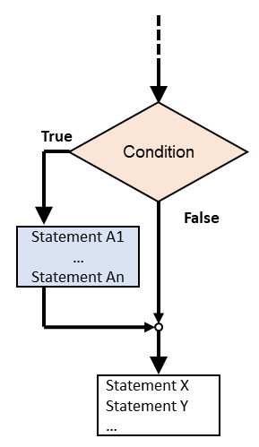
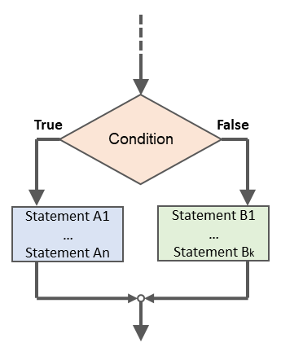
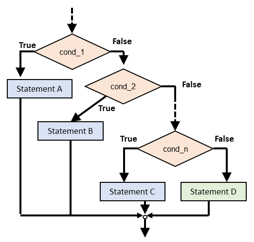
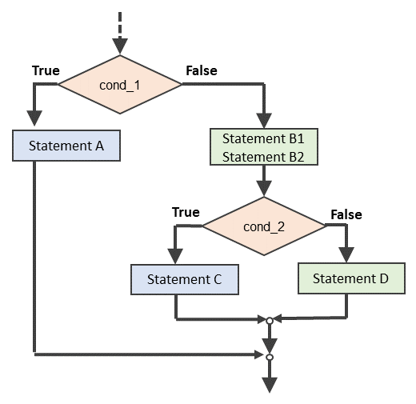

# Conditional statements



## Conditional Execution

In order to write useful programs, we almost always need the ability to check conditions and change the behaviour of the program accordingly. **Conditional statements** give us this ability. The simplest form is the `if` statement:


```python
if x > 0: 
    print('x is positive') 
```


The Boolean expression after the `if` statement is called the **condition**. If it is true, then the indented statement gets executed. If not, nothing happens. This is illustrated in the flow diagram below.

<figure><figcaption><p>Conditional <code>if</code> statement flow control diagram.</p></figcaption></figure>

`if` statements have the same structure as function definitions: a header followed by an indented body. Statements like this are called **compound statements**. There is no limit on the number of statements that can appear in the body, but there has to be at least one. Occasionally, it is useful to have a body with no statements (usually as a place keeper for code you haven't written yet). In that case, you can use the `pass` statement, which does nothing.


```python
if x < 0: 
    pass # need to handle negative values! 
```


## Alternative Execution

A second form of the `if` statement is `alternative execution` (also known as `if-else` statement), in which there are two possibilities and the condition determines which one gets executed. The syntax looks like this:


```python
if x % 2 == 0: 
    print('x is even') 
else: 
    print('x is odd') 
```


If the remainder when `x` is divided by 2 is 0, then we know that `x` is even, and the program displays a message to that effect. If the condition is false, the second set of statements is executed. Since the condition must be true or false, exactly one of the alternatives will be executed. The alternatives are called **branches**, because they are branches in the flow of execution. This is clearly illustrated in the flow diagram shown below.

<figure><figcaption><p>Conditional <code>if-else</code> statement flow control diagram.</p></figcaption></figure>

## Chained Conditionals

Sometimes there are more than two possibilities and we need more than two branches. One way to express a computation like that is a **chained conditional** (also known as `if-elif-else` statement):


```python
if x < y: 
    print('x is less than y') 
elif x > y: 
    print('x is greater than y') 
else: 
    print('x and y are equal')
```


`elif` is an abbreviation of "**else if"**. Again, exactly one branch will be executed. There is no limit on the number of `elif` statements. If there is an `else` clause, it has to be at the end, but there doesn't have to be one.


```python
if choice == 'a': 
    draw_a() 
elif choice == 'b': 
    draw_b() 
elif choice == 'c': 
    draw_c()
```


Each condition is checked in order. If the first is false, the next is checked, and so on. If one of them is true, the corresponding branch executes, and the statement ends. Even if more than one condition is true, only the first true branch executes. The flow diagram of a chained conditional is shown in below:

<figure><figcaption><p>Conditional <code>if-elif-else</code> statement flow-control diagram.</p></figcaption></figure>

## Nested Conditionals

One conditional can also be nested within another. We could have written the trichotomy example like this:


```python
if x == y: 
    print('x and y are equal') 
else: 
    if x < y: 
        print('x is less than y') 
    else: 
        print('x is greater than y')
```


The outer conditional contains two branches. The first branch contains a simple statement. The second branch contains another `if` statement, which has two branches of its own. Those two branches are both simple statements, although they could have been conditional statements as well. Although the indentation of the statements makes the structure apparent, **nested conditionals** become difficult to read very quickly. In general, it is a good idea to avoid them when you can.

Nested conditionals structures should be used when several statements are common to more than one sub-branch as illustrated in the diagram below:

<figure><figcaption><p>Nested conditionals <code>if</code> statements flow-control diagram.</p></figcaption></figure>

Here, statements `B1` and `B2` have been moved out of the nested `if` statement as it is common to branches `C` and `D`. The same flow of execution could have been done using chained conditionals, however statements `B1` and `B2` would have to be duplicate in each sub-branch.

Logical operators often provide a way to simplify nested conditional statements. For example, we can rewrite the following code using a single conditional:


```python
if 0 < x: 
    if x < 10: 
        print('x is a positive single-digit number.')
```


The `print` statement is executed only if we make it past both conditionals, so we can get the same effect with the `and` operator:


```python
if 0 < x and x < 10: 
    print('x is a positive single-digit number.')
```

