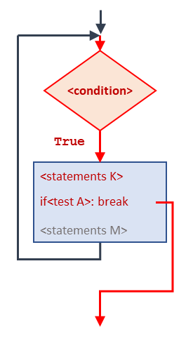
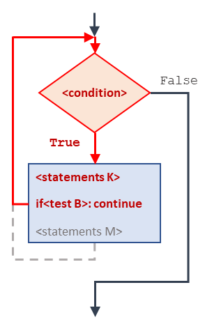

# break and continue statements

## `break` statement

Sometimes you don't know it's time to end a loop until you get half way through the body. In that case you can use the `break` statement to jump out of the loop.

For example, suppose you want to take input from the user until they type `done`. You could write:


```python
while True: 
    line = input('> ') 
    if line == 'done': 
        break 
    print('You wrote:', line)

print('Done!') 
```


The loop condition is `True`, which is always true, so the loop runs until it hits the break statement.

Each time through, it prompts the user with an angle bracket. If the user types `done`, the `break` statement exits the loop. Otherwise the program echoes whatever the user types and goes back to the top of the loop. Here's a sample run:

```
> not done
You wrote: not done 
> done 
Done!
```

A more general flow diagram using a break statement is shown below. In the middle of the body we have a `if` statement with a `testA` condition. If `testA` is true, the break statement is called and the program exits the loop immediately without executing statements `M`. Otherwise, the program skips over the break and continue the loop as normal.

<figure><figcaption><p>Flow-control diagram of a simple while loop <br>with a break statement. If <code>testA</code> is true, <br>the loop will terminate immediately.</p></figcaption></figure>

This way of writing `while` loops is common because you can check the condition anywhere in the loop (not just at the top) and you can express the stop condition affirmatively (stop when this happens) rather than negatively (keep going until that happens.).

## `continue`  statement

In Python, `continue` is a keyword used in loops (such as `for` and `while` loops) to skip over the remaining iterations of the loop and move on to the next iteration.

When the `continue` statement is encountered inside a loop, it immediately stops executing the rest of the statements in that iteration of the loop and moves on to the next iteration. This means that any code following the `continue` statement in that iteration will be skipped as shown in the figure below. In this diagram, if `testB` is `True`, the statements `M` is skipped and the loop moves on to the next iteration. Note that at the next iteration, `testB` might be `False` and statements `M` might be executed.

<figure><figcaption><p>Flow-control diagram of a simple while loop <br>with a <code>continue</code> statement. if <code>testB</code> is <code>True</code>,<br>the statements <code>M</code> is skipped and the loop moves<br>on to the next iteration.</p></figcaption></figure>

Here's an example to illustrate the use of `continue` in a `for` loop:


```python
numbers = [1, 2, 3, 4, 5]

for num in numbers:
    if num % 2 == 0:
        continue
    print(num)
```


In this example, we have a list of numbers and we're using a `for` loop to iterate over them. Inside the loop, we have an `if` statement that checks if the current number is even (i.e., divisible by 2). If it is, the `continue` statement is executed and the loop immediately moves on to the next iteration without executing the `print` statement. If the number is odd, the `print` statement is executed and the number is printed to the console.

The output of this code would be:

```
1
3
5
```

This is because the `continue` statement skipped over the even numbers (2 and 4) and only printed the odd numbers (1, 3, and 5).

In general, you should use the `continue` statement when you want to skip over certain iterations of a loop based on a particular condition, without exiting the loop entirely.

## Some considerations

In case you are wondering, you should not avoid using `break` and `continue` statements in Python programs. These statements are important flow-control statements that can make your code more efficient and easier to read.

`break` and `continue` statements are used in loops to change the normal flow of control. `break` is used to exit a loop prematurely, while `continue` is used to skip the current iteration of the loop and move on to the next one.

Using `break` and `continue` statements can make your code more efficient by avoiding unnecessary computations. For example, if you are searching for a particular value in a large list, you can use a `for` loop with a `break` statement to exit the loop as soon as you find the value, rather than continuing to iterate through the rest of the list.

Here's an example that illustrates the use of `break` to exit a loop prematurely:


```python
numbers = [1, 2, 3, 4, 5]

for num in numbers:
    if num == 3:
        break
    print(num)
```


In this example, we're using a `for` loop to iterate over a list of numbers. Inside the loop, we have an `if` statement that checks if the current number is equal to 3. If it is, the `break` statement is executed, and the loop is exited prematurely. If the number is not equal to 3, the `print` statement is executed, and the number is printed to the console.

The output of this code would be:

```bash
1
2
```

As you can see, the loop exited prematurely when it encountered the number 3, and did not print the remaining numbers in the list.

In general, you should use `break` and `continue` statements when they make your code more efficient and easier to read. However, it's also important to use them judiciously and not to overuse them, as this can make your code harder to understand and maintain.
