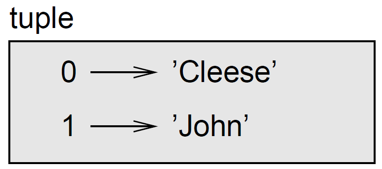
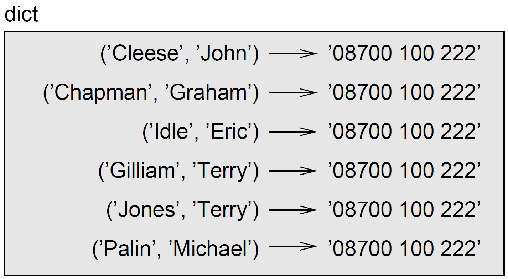

# Dictionaries



## Introduction

A **dictionary** is like a list, but more general. In a list, the indices have to be integers; in a dictionary they can be (almost) any type. You can think of a dictionary as a mapping between a set of indices (which are called **keys**) and a set of values. Each key maps to a value. The association of a key and a value is called a **key-value pair** or sometimes an **item**. As an example, we'll build a dictionary that maps from English to French words, so the keys and the values are all strings.

The function `dict` creates a new dictionary with no items. Because `dict` is the name of a built-in function, you should avoid using it as a variable name.

```bash
>>> eng2fr = dict()
>>> print(eng2fr)
 {} 
>>>
```

The curly-brackets, `{}`, represent an empty dictionary. To add items to the dictionary, you can use square brackets:

```bash
>>> eng2fr['one'] = 'un'
>>>
```

This line creates an item that maps from the key `'one'` to the value `'un'`. If we print the dictionary again, we see a key-value pair with a colon between the key and value:

```bash
>>> print(eng2fr)
 {'one': 'un'}
>>>
```

This output format is also an input format. For example, you can create a new dictionary with three items:

```bash
>>> eng2fr = {'one': 'un', 'two': 'deux', 'three': 'trois'}
```

But if you print `eng2fr`, you might be surprised:

```bash
>>> print(eng2fr)
 {'one': 'un', 'three': 'trois', 'two': 'deux'}
>>>
```

The order of the key-value pairs is not the same. In fact, if you type the same example on your computer, you might get a different result. In general, for Python version 3.6 or earlier, the order of items in a dictionary is unpredictable. However, since Python 3.7, the order in which the pair are added is retained. Anyway, that's not a problem because the elements of a dictionary are never indexed with integer indices. Instead, you use the keys to look up the corresponding values:

```bash
>>> print(eng2fr['two'])
 'deux'
>>>
```

The key `'two'` always maps to the value `'deux'` so the order of the items doesn't matter. If the key isn't in the dictionary, you get an exception:

```bash
>>> print(eng2fr['four'])
 Traceback (most recent call last): 
    File "<pyshell#19>", line 1, in 
    print(eng2fr['four']) 
 KeyError: 'four'
```

The `len` function works on dictionaries; it returns the number of key-value pairs:

```bash
>>>len(eng2fr)
 3
>>>
```

The `in` operator works on dictionaries; it tells you whether something appears as a _key_ in the dictionary (appearing as a value is not good enough).

```bash
>>> 'one' in eng2fr 
 True
>>> 'un' in eng2fr
 False
>>>
```

To see whether something appears as a value in a dictionary, you can use the method `values()`, which returns the values as a list, and then use the `in` operator:

```bash
>>> vals = eng2fr.values()
>>> 'un' in vals
 True 
>>>
```

The `in` operator uses different algorithms for lists and dictionaries. For lists, it uses a search algorithm, as in `find`. As the list gets longer, the search time gets longer in direct proportion. For dictionaries, Python uses an algorithm called a **hashtable** that has a remarkable property: the `in` operator takes about the same amount of time no matter how many items there are in a dictionary. I won't explain how that's possible, but you can read more about it on the [hashtable Wikipedia page](https://www.wikipedia.org/wiki/Hash\_table).

## Dictionary as a set of counters

Suppose you are given a string and you want to count how many times each letter appears. There are several ways you could do it:

1. You could create 26 variables, one for each letter of the alphabet. Then you could traverse the string and, for each character, increment the corresponding counter, probably using a chained conditional.
2. You could create a list with 26 elements. Then you could convert each character to a number (using the built-in function `ord`), use the number as an index into the list, and increment the appropriate counter.
3. You could create a dictionary with characters as keys and counters as the corresponding values. The first time you see a character, you would add an item to the dictionary. After that you would increment the value of an existing item.

Each of these options performs the same computation, but each of them implements that computation in a different way. An **implementation** is a way of performing a computation; some implementations are better than others. For example, an advantage of the dictionary implementation is that we don't have to know ahead of time which letters appear in the string and we only have to make room for the letters that do appear. Here is what the code might look like:


```python
def histogram(text): 
    hist = dict() 
    for character in text: 
        if character not in hist: 
            hist[character] = 1 
        else: 
            hist[character] += 1 
    return hist
```


The name of the function is **histogram**, which is a statistical term for a set of counters (or frequencies).

Line 2 creates an empty dictionary named `hist`. The `for` loop traverses the string `text`. Each time through the loop, if the character `character` is not in the dictionary, we create a new item with key `character` and the initial value `1` (since we have seen this letter once). If `character` is already in the dictionary we increment `hist[character]`. Here's how it works:

```bash
>>> h = histogram('brontosaurus')
>>> print(h)
 {'a': 1, 'b': 1, 'o': 2, 'n': 1, 's': 2, 'r': 2, 'u': 2, 't': 1}
>>>
```

The histogram indicates that the letters `'a'` and `'b'` appear once; `'o'` appears twice, and so on.

**Exercise:** Write a function that reads the words in a long string (or a text file) and stores them as keys in a dictionary. The values are the number of time the word appears in the text. Then you can use the `in` operator as a fast way to check whether a string is in the dictionary. If you did the exercise `wordlist1`, you can compare the speed of this implementation with the list `in` operator and the bisection search.

<details>

<summary>Answer:</summary>


</details>

**Exercise:** Dictionaries have a method called `get` that takes a key and a default value. If the key appears in the dictionary, `get` returns the corresponding value; otherwise it returns the default value. For example:

```bash
>>> h = histogram('brontosaurus')
>>> print(h)
 {'a': 1, 'b': 1, 'o': 2, 'n': 1, 's': 2, 'r': 2, 'u': 2, 't': 1}
>>> h.get('a', 0)
 1 
>>> h.get('z', 0)
 0
>>>
```

Use `get` to write `histogram` more concisely. You should be able to eliminate the `if` statement.

## Looping and dictionaries

If you use a dictionary in a `for` statement, it traverses the keys of the dictionary. For example, `print_histogram` prints each key and the corresponding value:


```python
def print_histogram(hist): 
    for character in hist: 
        print(character, hist[character])
```


Here's what the output looks like:

```bash
>>> h = histogram('parrot')
>>> print_histogram(h)
 a 1
 p 1 
 r 2 
 t 1 
 o 1
>>>
```

Again, the keys are in no particular order.

**Exercise:** Dictionaries have a method called `keys` that returns the keys of the dictionary, in no particular order, as a list. Modify `print_histogram` to print the keys and their values in alphabetical order.&#x20;

<details>

<summary>Answer</summary>


</details>

## Reverse lookup

Given a dictionary `d` and a key `k`, it is easy to find the corresponding value `v = d[k]`. This operation is called a **lookup**.

But what if you have `v` and you want to find `k`? You have two problems: first, there might be more than one key that maps to the value `v`. Depending on the application, you might be able to pick one, or you might have to make a list that contains all of them. Second, there is no simple syntax to do a **reverse lookup**; you have to search.  Here is a function that takes a value and returns the first key that maps to that value:


```python
def reverse_lookup(dico, value): 
    for key in dico: 
        if dico[key] == value: 
            return key 
    return None
```


This function is yet another example of the search pattern. If we get to the end of the loop, that means `value` doesn't appear in the dictionary as a value, so we return `None` to indicate that such a value does not exists in the dictionary.

Here are some an example of using a reverse lookup:

```bash
>>> h = histogram('brontosaurus') 
>>> k = reverse_lookup(h, 1) 
>>> print(k) 
 b 
>>> k = reverse_lookup(h, 3)
 None
>>>
```

A reverse lookup is much slower than a forward lookup; if you have to do it often, or if the dictionary gets big, the performance of your program will suffer.

**Exercise:** Modify `reverse_lookup` so that it builds and returns a list of **all** keys that map to a value `v`, or an empty list if there are none.&#x20;

<details>

<summary>Answer</summary>


</details>

## Dictionaries and lists

Lists can appear as values in a dictionary. For example, if you were given a dictionary that maps from letters to frequencies, you might want to invert it; that is, create a dictionary that maps from frequencies to letters. Since there might be several letters with the same frequency, each value in the inverted dictionary should be a list of letters.

Here is a function that inverts a dictionary:


```python
def invert_dict(dico): 
    inverted = dict() 
    for key in dico: 
        value = dico[key] 
        if value not in inverted: 
            inverted[value] = [key] 
        else: inverted[value].append(key) 
    return inverted 
```


Each time through the loop, `key` gets a key from `dico` and `value` gets the corresponding value. If `value` is not in `inverted`, that means we haven't seen it before, so we create a new item and initialize it with a **singleton** (a list that contains a single element). Otherwise we have seen this value before, so we append the corresponding key to the list.

Here is an example:

```bash
>>> h = histogram('parrot') 
>>> print(h)
 {'p': 1, 'a': 1, 'r': 2, 'o': 1, 't': 1}
>>>  inv = invert_dict(h) 
 print(inv) {1: ['p', 'a', 'o', 't'], 2: ['r']} 
>>> 
```

Lists can be values in a dictionary, as this example shows, but they cannot be keys. Here's what happens if you try:&#x20;

```
>>> lst = [1,2,3] 
>>> dico = dict() 
>>> dico[lst] = 'oops' 
 Traceback (most recent call last): 
     File "<pyshell#17>", line 1, in dico[lst] = 'oops' 
 TypeError: unhashable type: 'list' 
```

I mentioned earlier that a dictionary is implemented using a **hashtable** and that means that the keys have to be **hashable**. A **hash** is a function that takes a value (of any kind) and returns an integer. Dictionaries use these integers, called hash values, to store and look up key-value pairs. This system works fine if the keys are immutable. But if the keys are mutable, like lists, bad things happen. For example, when you create a key-value pair, Python hashes the key and stores it in the corresponding location. If you modify the key and then hash it again, it would go to a different location. In that case you might have two entries for the same key, or you might not be able to find a key. Either way, the dictionary wouldn't work correctly.&#x20;

That's why the keys have to be hashable, and why mutable types like lists aren't. The simplest way to get around this limitation is to use [tuples](../a-deeper-dive-into-strings-lists-and-tuples/more-on-tuples.md). Since dictionaries are mutable, they can't be used as keys, but they can be used as values.

**Exercise:** Read the documentation of the dictionary method `setdefault()` and use it to write a more concise version of `invert_dict`.

<details>

<summary>Answer</summary>


</details>

## Dictionaries and tuples

Dictionaries have a method called `items()`} that returns a `dict_items` object (kind of a list of tuples), where each tuple is a key-value pair. But a proper list can be created from the object using the `list` constructor.

```bash
>>> d = {'a':0, 'b':1, 'c':2}
>>> t = list(d.items()) 
>>> print(t)
 [('a', 0), ('b', 1), ('c', 2)] 
>>>
```

Conversely, you can use a list of tuples to initialize a new dictionary:

```bash
>>> t = [('a', 0), ('c', 2), ('b', 1)]
>>> d = dict(t)
>>> print(d)
 {'a': 0, 'c': 2, 'b': 1}
>>>
```

Combining `dict` with `zip` yields a concise way to create a dictionary:

```bash
>>> d = dict(zip('abc', range(3))) 
>>> print(d)
 {'a': 0, 'c': 2, 'b': 1}
>>>
```

However, be careful when the first parameter contains duplicate as you may not get the expected result as shown below:

<pre class="language-bash"><code class="lang-bash">>>> d = dict(zip('abba', range(4)))
>>> print(d)
<strong> {'a': 3, 'b': 2}
</strong><strong>>>>
</strong></code></pre>

The dictionary method `update()` also takes a list of tuples and adds them, as key-value pairs, to an existing dictionary.

Combining `item`, tuple assignment and `for`, you get the idiom for traversing the keys and values of a dictionary:


```python
for key, val in d.items(): 
    print(val, key)
```


The output of this loop is:

```
0 a 
2 c 
1 b
```

It is common to use tuples as keys in dictionaries (primarily because you can't use lists). For example, a telephone directory might map from last-name, first-name pairs to telephone numbers. Assuming that we have defined `last`, `first` and `number`, we could write:

```bash
>>> last = 'Blot'
>>> first = 'Lilian'
>>> number = '00705101962'
>>> directory[(last,first)] = number
>>>
```

The expression in brackets is a tuple. We could use tuple assignment to traverse this dictionary.


```python
for last, first in directory: 
    print(first, last, directory[(last,first)]) 
```


This loop traverses the keys in `directory`, which are tuples. It assigns the elements of each tuple to `last` and `first`, then prints the name and corresponding telephone number.

There are two ways to represent tuples in a state diagram. The more detailed version shows the indices and elements just as they appear in a list. For example, the tuple `('Cleese', 'John')` would appear:

<figure><figcaption><p>Tuple representation in a state diagram</p></figcaption></figure>

But in a larger diagram you might want to leave out the details. For example, a diagram of the telephone directory might appear:

<figure><figcaption><p>Dictionary representation in a state diagram.</p></figcaption></figure>

Here the tuples are shown using Python syntax as a graphical shorthand.
