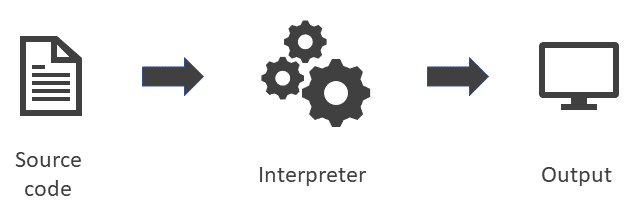
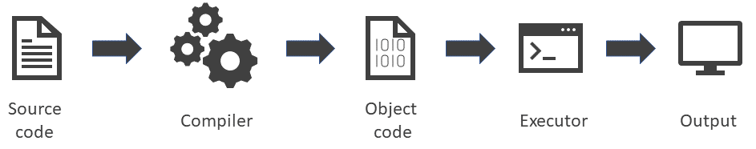

# Python Programming Language



## Formal and natural languages

**Definition -Natural languages** are the languages people speak, such as English, Spanish, and French. They were not designed by people (although people try to impose some order on them); they evolved naturally.

**Definition - Formal languages** are languages that are designed by people for specific applications. For example, the notation that mathematicians use is a formal language that is particularly good at denoting relationships among numbers and symbols. Chemists use a formal language to represent the chemical structure of molecules.

> Programming languages are formal languages that have been designed to express computations.

Formal languages tend to have strict rules about syntax. For example, `3 + 3 = 6` is a syntactically correct mathematical statement, but `3 + = 6£3` is not. Syntax rules come in two flavours, pertaining to **tokens** and **structure**. Tokens are the basic elements of the language, such as words, numbers, operators. One of the problems with `3 + = 6£3` is that `£` is not a legal token in mathematics.

The second type of syntax error pertains to the structure of a statement; that is, the way the tokens are arranged. The statement `3+= 6 - 3` is illegal because even though `+` and `=` are legal tokens, you can't have one right after the other.

When you read a sentence in English or a statement in a formal language, you have to figure out what the structure of the sentence is (although in a natural language you do this subconsciously). This process is called **parsing**.

For example, when you hear the sentence, "The penny dropped" you understand that "the penny" is the subject and "dropped" is the predicate. Once you have parsed a sentence, you can figure out what it means, or the semantics of the sentence. Assuming that you know what a penny is and what it means to drop, you will understand the general implication of this sentence.

Although formal and natural languages have many features in common-tokens, structure, syntax, and semantics-there are some important differences:

* **Ambiguity:** Natural languages are full of ambiguity, which people deal with by using contextual clues and other information. Formal languages are designed to be nearly or completely unambiguous, which means that any statement has exactly one meaning, regardless of context.
* **Redundancy:** In order to make up for ambiguity and reduce misunderstandings, natural languages employ lots of redundancy. As a result, they are often verbose. Formal languages are less redundant and more concise.
* **Literalness:** Natural languages are full of idiom and metaphor. If I say, "[The penny dropped](#user-content-fn-1)[^1]", there is probably no penny and nothing dropping. Formal languages mean exactly what they say.

Here are some suggestions for reading programs (and other formal languages). First, remember that formal languages are much more dense than natural languages, so it takes longer to read them. Also, the structure is very important, so it is usually not a good idea to read from top to bottom, left to right. Instead, learn to parse the program in your head, identifying the tokens and interpreting the structure. Finally, the details matter. Small errors in spelling and punctuation, which you can get away with in natural languages, can make a big difference in a formal language.

## The Python programming language

The programming language you will learn is Python. Python is an example of a {\bf high-level language}; other high-level languages you might have heard of are C++, C#, VB, JavaScript, and Java.

There are also **low-level languages**, sometimes referred to as machine languages or assembly languages. Loosely speaking, computers can only execute programs written in low-level languages. So programs written in a high-level language have to be processed before they can run. This extra processing takes some time, which is a small disadvantage of high-level languages.

The advantages are enormous. First, it is much easier for a human to program in a high-level language. Programs written in a high-level language take less time to write, they are shorter and easier to read, and they are more likely to be correct. Second, high-level languages are **portable**, meaning that they can run on different kinds of computers with few or no modifications. Low-level programs can run on only one kind of computer and have to be rewritten to run on another. Due to these advantages, almost all programs are written in high-level languages. Low-level languages are used only for a few specialised applications.

Two kinds of programs process high-level languages into low-level languages: **interpreters** and **compilers**. An interpreter reads a high-level program and executes it, meaning that it does what the program says. It processes the program a little at a time, alternately reading lines and performing computations.

<figure><figcaption><p>process high-level languages into low-level languages using an interpreter</p></figcaption></figure>

A compiler reads the program and translates it completely before the program starts running. In this context, the high-level program is called the **source code**, and the translated program is called the **object code** or the **executable**. Once a program is compiled, you can execute it repeatedly without further translation.

<figure><figcaption><p>process high-level languages into low-level languages using a compiler</p></figcaption></figure>

Python is considered an interpreted language because Python programs are executed by an interpreter. There are two ways to use the interpreter: **interactive mode** and **script mode**. In interactive mode, you type Python programs and the interpreter prints the result:

```bash
>>> 1 + 1
 2
>>>
```

The chevron, <mark style="color:blue;">>>></mark>, is the **prompt** the interpreter uses to indicate that it is ready. If you type 1 + 1, the interpreter replies 2, the evaluation of the expression 1+1.

Alternatively, you can store code in a file and use the interpreter to execute the contents of the file, which is called a **script**. By convention, Python scripts have names that end with `.py`. To execute the script, you have to tell the interpreter the name of the file. In a Windows command shell, you would type:

```bash
C:\code> python helloworld.py
```

where `helloworld.py` is the script located in the folder `C:\code` you want to execute. In other development environments, the details of executing scripts are different. You can find instructions for your environment at the Python website [python.org](https://www.python.org). Please note that in this example, we assume that `python.exe` is in your windows `PATH`.

Working in interactive mode is convenient for testing small pieces of code because you can type and execute them immediately. But for anything more than a few lines, you should save your code as a script so you can modify and execute it in the future.

[^1]: This idiom means that someone realised something after a period of confusion.
