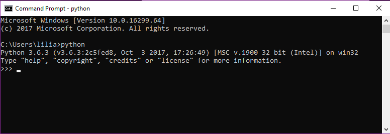
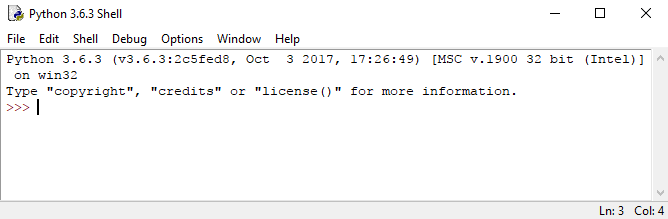

# The first program

Traditionally, the first program you write in a new language is called `"Hello, World!"` because all it does is display the words, "Hello, World!"

Before we can write our first program we need to launch the Python interpreter. In this book, we assume you have Python 3 installed on the Windows 10 or later operating system. There are two ways to launch Python:&#x20;

* Open a command window, and at the prompt type `python.` If the interpreter is not started like shown in the figure below, you may want to check that Python is in your `PATH` environment variable.

<figure><figcaption><p>Using the Python interpreter from the command shell</p></figcaption></figure>

* Open IDLE(Python 3.6 32 bits) from the Windows start menu. A Python shell opens and is ready to accept your code:

<figure><figcaption><p>Using the Python interpreter via IDLE</p></figcaption></figure>

Now that we have a Python shell opened, we can write our program. In Python 3, it looks like this:

```python
>>> print('Hello, World!') 
Hello, World!
```

The quotation marks in the program mark the beginning and end of the text to be displayed; they don't appear in the result.

Now that we can start programming, it might be a good time to illustrate the type of errors we may encounter whilst programming. The first one we mentioned was a syntax error like this one:

<pre class="language-python"><code class="lang-python">>>> 1 + 2) 
<a data-footnote-ref href="#user-content-fn-1">SyntaxError:</a> invalid syntax
>>>
</code></pre>

where the opening bracket is missing.

The second type of error are runtime errors like the division by zero shown here:

```python
>>> print(10/0) 
Traceback (most recent call last): File "<pyshell#1>", line 1, in print(10/0) 
ZeroDivisionError: division by zero
>>>
```

Probably the most challenging one is a semantic error. For example, if we try to convert a temperature $$t_F$$ in Fahrenheit into Celsius the formula to use is:

$$
\begin{equation*} t_C = \frac{5}{9}(t_F - 32)  \end{equation*}
$$


Now if we write the following implementation:

```python
>>> print('Fahrenheit 35 in Celsius degree is:', 5/9*35-32) 
Fahrenheit 35 in Celsius degree is: -12.555555555555554
```

the program runs and does not create any error. Does that mean that the program is correct? Unfortunately, NO. The result should have been `1.66` not `-12.55`.

#### Exercise

Write the correct implementation of the conversion from Fahrenheit to Celsius.

<details>

<summary>Answer</summary>

```python
print('Fahrenheit 35 in Celsius degree is:', 5/9*(35-32))
```

</details>

In conclusion, it is not because your program runs and returns a result that your work is finished. You must ensure that the returned result is correct. It is essential when implementing a code to define a series of tests (i.e. a series of known outputs given certain inputs) that can validate your code.

##

## Glossary and Exercises

<details>

<summary>Glossary</summary>

**Problem solving:** The process of formulating a problem, finding a solution, and expressing the solution.&#x20;

**High-level language:** A programming language like Python that is designed to be easy for humans to read and write.&#x20;

**Low-level language:** A programming language that is designed to be easy for a computer to execute; also called machine language or assembly language.

**Portability:** A property of a program that can run on more than one kind of computer.&#x20;

**Interpret:** To execute a program in a high-level language by translating it one line at a time.&#x20;

**Compile:** To translate a program written in a high-level language into a low-level language all at once, in preparation for later execution.&#x20;

**Source code:** A program in a high-level language before being compiled.&#x20;

**Object code:** The output of the compiler after it translates the program.

**Executable:** Another name for object code that is ready to be executed.&#x20;

**Prompt:** Characters displayed by the interpreter to indicate that it is ready to take input from the user.

**Script:** A program stored in a file (usually one that will be interpreted).

**Interactive mode:** A way of using the Python interpreter by typing commands and expressions at the prompt.

**Script mode:** A way of using the Python interpreter to read and execute statements in a script.

**Program:** A set of instructions that specifies a computation.&#x20;

**Algorithm:** A general process for solving a category of problems.

**Bug:** An error in a program.&#x20;

**Debugging:** The process of finding and removing any of the three kinds of programming errors.

**Syntax:** The structure of a program.

**Syntax error:** An error in a program that makes it impossible to parse (and therefore impossible to interpret).

**Exception:** An error that is detected while the program is running.

**Semantics:** The meaning of a program.

**Semantic error:** An error in a program that makes it do something other than what the programmer intended.

**Natural language:** Any one of the languages that people speak that evolved naturally.

**Formal language:** Any one of the languages that people have designed for specific purposes, such as representing mathematical ideas or computer programs; all programming languages are formal languages.

**Token:** One of the basic elements of the syntactic structure of a program, analogous to a word in a natural language.

**Parse:** To examine a program and analyze the syntactic structure.

**Print statement:** An instruction that causes the Python interpreter to display a value on the screen.&#x20;

</details>

<details>

<summary>Exercise: Python Documentation</summary>

Use a web browser to go to the Python website \url{python.org}. This page contains information about Python and links to Python-related pages, and it gives you the ability to search the Python documentation. For example, if you enter {\tt print} in the search window, the first link that appears is the documentation of the {\tt print} statement. At this point, not all of it will make sense to you, but it is good to know where it is.

</details>

<details>

<summary>Exercise: A simple calculator</summary>

Start the Python interpreter and use it as a calculator. Python's syntax for math operations is almost the same as standard mathematical notation. For example, the symbols `+`, `-` and `/` denote addition, subtraction and division, as you would expect. The symbol for multiplication is `*`. If you run a 10 kilometres race in 43 minutes and 30 seconds, what is your average time per mile? What is your average speed in miles per hour? (Hint: there are 1.61 kilometres in a mile).

</details>

[^1]: 
